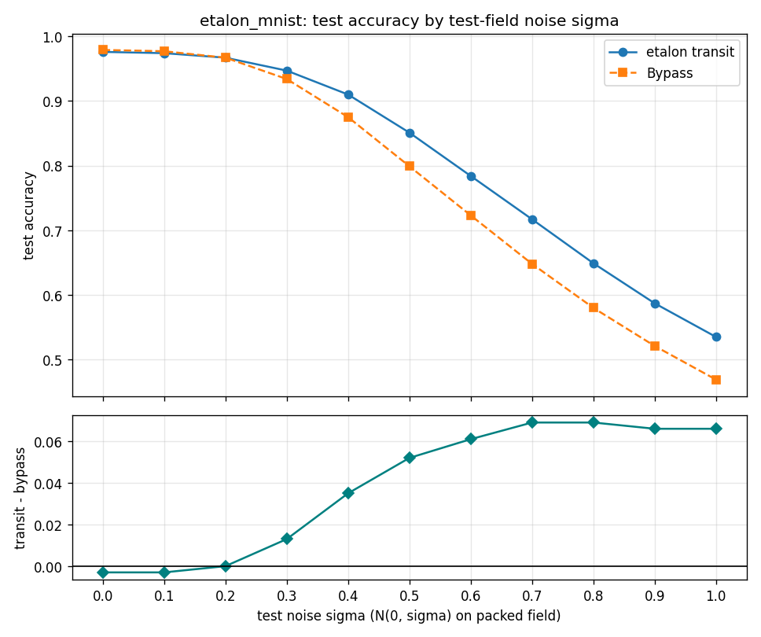

# Hypercube Etalon

[](https://github.com/dliptak001/HypercubeEtalon/actions/workflows/wheels.yml)
[](https://pypi.org/project/hypercube-etalon/)
[](https://pypi.org/project/hypercube-etalon/)
[](LICENSE)
[](https://en.cppreference.com/w/cpp/23)

HypercubeEtalon processes spatial data of the kind presented to a CNN.
It is built from three core classes.

The **Etalon** class wraps the other two and manages training and
prediction.

The other two form a pipeline: preprocessor → readout.

The **Exciter** class is a preprocessing stage that consumes input
patterns, mixes them nonlinearly, and returns a field with the same
dimensions as the input.

The **Readout** class is a small HypercubeCNN that classifies or
regresses that field.

This is not reservoir computing.

The point of this experiment is to see if a preprocessing stage in
front of HypercubeCNN outperforms HypercubeCNN by itself. HypercubeWTF
has the same goal; it just does it a slightly different way, using a
**reservoir** with synthetic time, whereas here the preprocessor is an
**etalon**. The aim is a hypercube preprocessor effective enough that
the readout can be a single layer with a single convolutional channel
(weird, I know) and no pooling. Then training is fast, the memory
footprint is small, and little to no architectural engineering is
required for the CNN.

---

<p align="center">
  <strong>HypercubeAI ecosystem</strong><br/>
</p>

<p align="center">
  <a href="https://github.com/dliptak001/HypercubeESN"><strong>HypercubeESN</strong></a>
  &nbsp;·&nbsp;
  <a href="https://github.com/dliptak001/HypercubeCNN"><strong>HypercubeCNN</strong></a>
  &nbsp;·&nbsp;
  <a href="https://github.com/dliptak001/HypercubeHopfield"><strong>HypercubeHopfield</strong></a>
  &nbsp;·&nbsp;
  <a href="https://github.com/dliptak001/HypercubeWTF"><strong>HypercubeWTF</strong></a>
  &nbsp;·&nbsp;
  <a href="https://github.com/dliptak001/HypercubeEtalon"><strong>HypercubeEtalon</strong></a>
  &nbsp;·&nbsp;
  <a href="https://github.com/dliptak001/HypercubeCascade"><strong>HypercubeCascade</strong></a>
  &nbsp;·&nbsp;
  <a href="https://github.com/dliptak001/HypercubeLCN"><strong>HypercubeLCN</strong></a>
</p>

HypercubeEtalon is an experiment in the **HypercubeAI** project — our quest to
systematically re-implement classical neural architectures on a Boolean
hypercube topology instead of Euclidean grids or random graphs. The central
thesis is “topology-native intelligence”: the hypercube’s algebraic structure
(vertex-transitive symmetry, Hamming geometry, bitwise addressing) can serve
as a first-class computational substrate.

- **A topology you don’t store** — the graph is specified: connectivity is
  implicit in the vertex indices; with a seed and a few config scalars the whole
  reservoir reconstructs mathematically.
- **Perfect homogeneity** — every vertex has the same degree and the same local
  world, so local dynamics mean the same thing everywhere — no structural
  favorites baked in by a random graph.
- **Cheap navigation** — each neighbor is a few bit operations on the vertex
  index, not a pointer chase through a stored edge list, so walks stay
  arithmetic and cache-friendly.
- **Topology-native pairing** — the readout consumes the reservoir’s output with
  zero geometric distortion, and the learned kernels exploit the same locality
  that generated the dynamics. The data never leaves the hypercube it was born
  on.

Each product in the family is a different architecture on that same foundation.

---

## The Etalon

I now suspect that the hypercube will someday be recognized as the most
natural (least contrived) and at the same time the most powerful neural
network substrate that can possibly be realized.

The **Etalon** construct is just another example of how incredibly
elegant solutions can be built on that substrate.

Etalon is a term borrowed from optics. The physical etalon is a pair of
plane-parallel, highly reflective surfaces (mirrors) between which an
optical signal propagates. It is used for laser resonators,
interferometric measurement, and filtering.

On the hypercube, an `etalon` is a pair of vertices: any vertex and its
antipode. A hypercube has `N` vertices and therefore `N` etalons on the
full cube. There are far more than `N` once the cube is subdivided into
subcubes, each of which carries its own set of etalons.

The HypercubeEtalon design treats a vertex and its antipode as a
reflective cavity. All vertices in between contribute to the evolution
of an input signal. That procedure is an **etalon transit**. It goes
something like this.

    LOOP:

        Pick a vertex r and its antipode r'. This defines an etalon.

        Copy the input field onto the cube. That overlay is the initial
        condition, and it is the same for every etalon.

        Starting at r, form the weighted sum of its nearest neighbors
        and write tanh of that sum into r.

        Move to the next vertex along the etalon, form the neighbor
        sum, and write tanh of that sum into that vertex.

        Order is causal: a later vertex sees values the earlier ones
        just wrote.

        Continue until the transit reaches the antipode r', then turn
        around and go back to the starting vertex.

        The starting vertex is then updated for the second time. That
        is its final value, which is copied to an output buffer.

        For that etalon the task is done.

    GOTO LOOP

The loop repeats until every vertex (every etalon) has been processed,
which fully populates the output buffer.

---

## White noise filter

The etalon preprocessor behaves as a near unity passthrough at low
to no white noise levels, and offers a meaningful filtering effect
at moderate to high noise levels. The write-up is
[`examples/mnist/WhiteNoiseFilter.md`](examples/mnist/WhiteNoiseFilter.md).



## Raman baseline extraction (a vibrational spectroscopy application)

The first real-world test is Raman spectra: recover the slow
fluorescence background under sharp molecular peaks without
lifting the baseline into the bands or cutting trenches beneath
them. Polynomials, asymmetric least squares, and ordinary
convolutional nets tend to follow the empty stretches well and then
fail where it matters, under peaks and peak clusters. Analysts have
worked around that for decades with spectrum-specific cleanup,
because no method identifies and extracts a true baseline across a
broad range of peak intensities and baseline characteristics
without occasional, and often frequent, human intervention.

The Etalon appears to have solved that problem (albeit on synthetic
data only so far).

Trained for 60 epochs on the LCOHard set — 10,000 synthetic LiCoO₂
(lithium cobalt oxide) spectra — it scores a validation RMSE of
4.77 counts on 2,000 held-out spectra whose baselines span
hundreds of counts.

Below are four held-out validation spectra: grey is the raw
spectrum, red the true baseline, blue the extract. For all four
shown here, and for each of the remaining 1996 validation spectra
not shown, baseline identification is, **WITHOUT EXCEPTION**,
quite remarkable.

And it does this with the thin readout the project aims for: one
HypercubeCNN layer, one convolutional channel, no pooling.

In our judgment this at least matches the best of the established
techniques on spectra like these, and very likely beats them.


### Three hosts, one floor

The Etalon is the whole preprocessor here: one transit, then the
readout. On spectra like these that is already enough.

Two siblings have now run the same task with the same readout, the
same 60-epoch budget, and the same split. The two-stage
([HypercubeCascade](https://github.com/dliptak001/HypercubeCascade))
puts a frozen HypercubeWTF reservoir behind this very transit and
scores 4.82. The reservoir-only
([HypercubeWTF](https://github.com/dliptak001/HypercubeWTF)) runs
that reservoir alone, with the normalized spectrum as its drive, and
scores 4.76. Three preprocessors that share no mechanism — a
transit, an orbit, and the two in series — carry the same one-layer,
one-channel readout to the same floor, and their overlays are
indistinguishable from the ones shown.

Real spectra, however, are not nearly this clean. Low laser power,
short integration times, and weak scatterers all put noise on the
spectrum, and that is where a baseline extractor has to earn its
keep.

That is where the hosts should separate. The Cascade's MNIST
white-noise study
([`examples/mnist/WhiteNoiseFilter.md`](https://github.com/dliptak001/HypercubeCascade/blob/main/examples/mnist/WhiteNoiseFilter.md))
found the two-stage path pulling ahead of the Etalon alone from
moderate noise up, and WTF's own study
([`examples/mnist/WhiteNoiseFilter.md`](https://github.com/dliptak001/HypercubeWTF/blob/main/examples/mnist/WhiteNoiseFilter.md))
found its reservoir a filter that holds accuracy as the noise rises.

That is the next experiment.

The overlay, the training profile, and the three-host comparison are
in
[`examples/RamanBaselineExtraction/`](examples/RamanBaselineExtraction/README.md).

Runnable programs live under [`examples/`](examples/README.md).

The Raman spectra themselves (about 1 GB) are not in this repository.

## SDKs

**C++** — link `HypercubeEtalonCore`, include `Etalon.h`, work with
`Etalon`. The guide is [`docs/CPP_SDK.md`](docs/CPP_SDK.md).

**Python** — `pip install hypercube-etalon`, import `hypercube_etalon`,
work with `Etalon`. The guide is
[`docs/Python_SDK.md`](docs/Python_SDK.md); the PyPI-facing package readme is
[`python/README.md`](python/README.md). Bindings build from this repo via
`pip install ./python` (pybind11 + scikit-build; does not use the CLion
`cmake-build-*` trees).

```python
import numpy as np
import hypercube_etalon as he

et = he.Etalon(dim=7, exciter_subcube_dim=5, exciter_input_scaling=1.0,
               exciter_weight_scaling=0.15, readout_num_outputs=6,
               readout_task="classification", readout_epochs=100)
et.fit(fields_train, labels_train)          # (count, N) float32, (count,) int
test_acc = et.accuracy(fields_test, labels_test)
```
