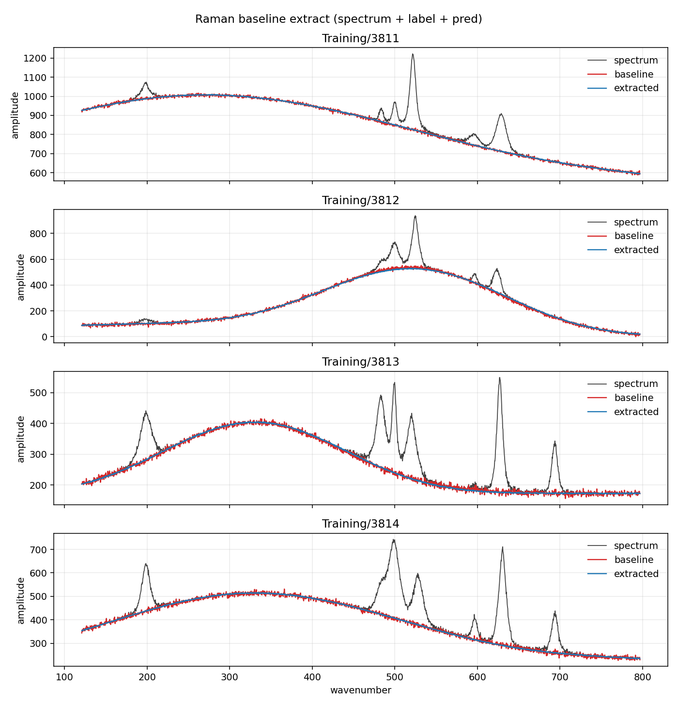
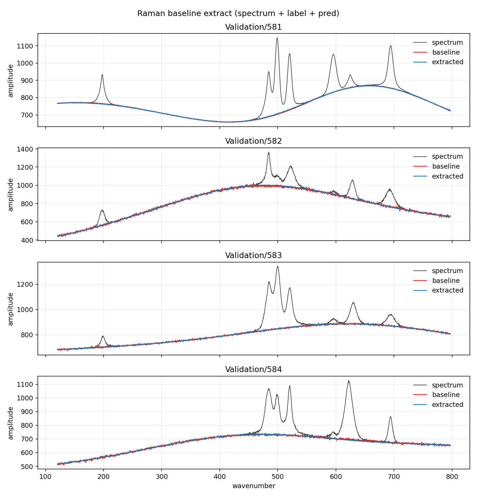

# Raman Baseline Extraction

A Raman spectrum is an array of intensity values: sharp molecular
peaks sitting on a slow fluorescence background. The task is to
characterize that background so that it can, in follow-on steps, be
subtracted from the original spectrum, leaving only pristine Raman
peaks remaining. That extraction is the part conventional methods
fail, often miserably, at. Polynomials, asymmetric least squares, and
ordinary convolutional nets follow the empty stretches and then ride
up into the vibrational excitation bands or cut a hole under them.

HypercubeEtalon recovers the fluorescence through the peak clusters.

The overlays below come from a hundred-epoch fit on synthetic LiCoO₂
(lithium cobalt oxide, LCO) spectra. Ten thousand spectra for
training, a thousand held out. The HypercubeCNN readout that drew
the blue curve is one layer, one channel, no pooling.

Grey is the raw spectrum, red is the true baseline, blue is the
extract. They agree to a few counts (training RMSE 4.48,
validation 4.59) while the fluorescence itself swings by hundreds.
The extract stays on the background instead of climbing into the
bands. The validation panel is the same picture. The network did
not memorize the training set.



Training/3811–3814. Blue and red sit on the same slow curve. The
peaks stay in the spectrum.



Validation/581–584. Same fidelity on spectra the readout never fit.

---

## Dataset on disk

Fixed root (read in place, not copied):

```text
C:\HypercubeEtalon\RamanSpectraLCO\
  Training\
  Validation\
```

| Split | Patterns | Index range |
|-------|----------|-------------|
| Training | 10000 | `0` … `9999` |
| Validation | 1000 | `0` … `999` |

Each pattern `X` is three files. Both splits also have one shared axis file.

```text
X.data.txt      input spectrum
X.label.txt     ground-truth baseline (train / score target)
X.peaks.txt     ignore for now
xaxis.txt       2048 wavenumbers; unused (axis is 0 … 2047)
```

Indices are contiguous. Training and validation reuse the same numeric names
in their own folders; they are different spectra.

---

## File format

- One line, no header.
- 2048 comma-separated ASCII floating-point amplitudes.
- Same count in `.data`, `.label`, `.peaks`, and `xaxis.txt`.

---

## Scale

Per-spectrum min/max from the **input**, never the label, mapped to
**[-1, 1]**:

```text
range = max - min
u     = (x - min) / range
norm  = 2 * u - 1
x     = (norm + 1) * 0.5 * range + min

If the spectrum is flat, range is 0, norm is 0, and denorm is min.
```

The label uses the **same** min/range as its matching `.data` spectrum, not
its own min/max. Predict only has the input, so the scale has to come from
there.

Collect and train see only these normalized values. `Predict` denormalizes
before it returns.

---

## Error

Score is **RMS** of the denormalized prediction vs raw `X.label.txt`.
No curve fit.

Per spectrum, over the 2048 bins:

```text
err[i]  = label[i] - predicted[i]
RMSE    = sqrt( mean( err[i]^2 ) )
```

On a split (train prefix or validation prefix), take the mean of those
per-spectrum MSEs, then sqrt — same as RMSE over every bin in the split.

That is the number this example reports. Each readout epoch prints
train `train_rmse`. After fit, the same score is printed on the train
prefix and the validation prefix. Peaks and percent-of-peak error are
out of scope.

---

## Seed

HypercubeEtalon is highly insensitive to the Exciter seed. That is a
feature: seed is not a tuning parameter.

Three independent `exciter.seed` values, same everything else, full
split (10000 train / 1000 validation), denormalized val RMSE:

| val RMSE |
|---------:|
| 6.155 |
| 6.147 |
| 6.184 |

Spread is 0.037 on a mean of 6.162 (about 0.6%).
